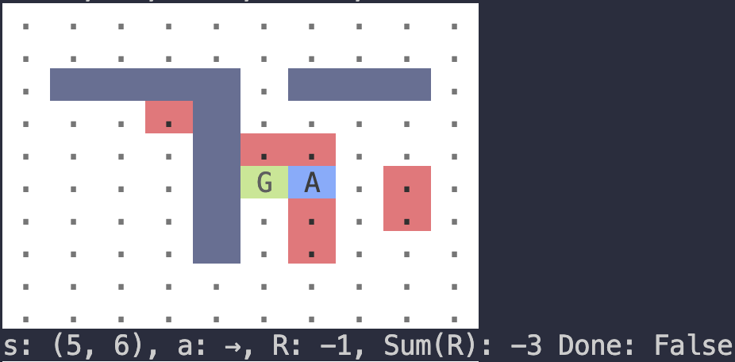

# 🤖 REINFORCEpy

Implementation of the [REINFORCEjs library](https://github.com/karpathy/reinforcejs/tree/master) from Kaparthy in Python. The original library has been implemented in JavaScript. The objective of this repository is to implement the RL algorithms and the demos in Python.

> Note that this is not a 1-to-1 implementation in Python. The idea is simply trying to develop similar algorithms and demos as shown in Kaparthy's library.

The current version looks as follows:



Run using 

```bash
python main.py \
    --verbose=1 \
    --episodes=1 \
    --timesteps=1 \
    --size=10 \
    --algo=value_iteration \
    --render_large=True \
    --render_with_values=True
```

## 📝 ToDo's

- [ ] Implement the GridWorld environment
- [ ] Implement unit-test structure to easily add tests
- [ ] Implement [GridWorld DP](https://cs.stanford.edu/people/karpathy/reinforcejs/gridworld_dp.html)
